# 🖥️ Windows Server 2019 — Active Directory Home Lab

## 📋 Project Overview
Built a complete Active Directory home lab using VirtualBox 
to simulate a real enterprise IT environment.

## 🛠️ Tools & Technologies
| Tool | Version |
|------|---------|
| Windows Server | 2019 |
| Windows Client | 10 Pro |
| Virtualization | Oracle VirtualBox |
| Network Type | Host-Only Adapter |

## ✅ What I Built
| Task | Status |
|------|--------|
| Domain Controller Setup | ✅ Done |
| DNS Configuration | ✅ Done |
| Domain Join (Windows 10) | ✅ Done |
| User Creation (ali, Khan) | ✅ Done |
| Security Group (IT-Team) | ✅ Done |
| Group Policy — Wallpaper | ✅ Done |
| Group Policy — Network Drive | ✅ Done |
| Shared Folder Permissions | ✅ Done |

---

## 📸 Screenshots

### 🖥️ Server Side

*1️⃣ Server IP Configuration*

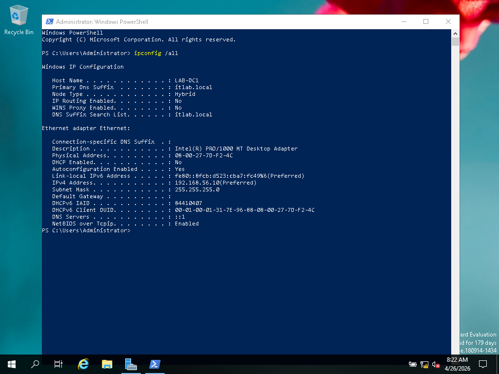

> Configured static IP 192.168.56.10 on Domain Controller 
> using Host-Only adapter in VirtualBox

---

*2️⃣ Active Directory Users*

> Created domain users ali and Khan in Active Directory 
> Users and Computers under itlab.local domain

---

*3️⃣ AD User List*

> Full list of Active Directory users showing ali and Khan 
> both enabled and active in itlab.local domain

---

*4️⃣ IT-Team Security Group Members*

> Created Security Group IT-Team and added ali and Khan 
> as members for centralized permission management

---

*5️⃣ DNS Zone Configuration*

> Configured DNS Forward Lookup Zone for itlab.local with 
> all required SRV, A, NS and SOA records for AD to work

---

*6️⃣ Group Policy Objects*

> Created two GPOs linked to itlab.local:
> Desktop-Policy (wallpaper) and Network-Drive-Policy (Z: drive)

---

*7️⃣ Shared Folder*

> Created ITLabShare with Full Control permissions 
> assigned to IT-Team security group

---

*8️⃣ Domain Controller Proof*

> Verified Domain Controller role, domain name itlab.local 
> and all Active Directory services running correctly

---

### 💻 Windows 10 Client Side

*9️⃣ Domain Login Proof*

> Successfully logged into Windows 10 using domain 
> credentials itlab\Khan proving successful domain join

---

*🔟 Z: Drive Auto Mapped*

> Network drive Z: automatically mapped on login via 
> Group Policy for all domain users without manual setup

---

*1️⃣1️⃣ Shared Files Access*

> Both users ali and Khan successfully created, read 
> and deleted files proving Full Control permissions working

---

*1️⃣2️⃣ GPO Wallpaper Applied*

> Desktop wallpaper automatically enforced on Windows 10 
> client via Group Policy proving GPO applied successfully

---

*1️⃣3️⃣ Network Settings*

> Windows 10 client DNS configured pointing to Domain 
> Controller 192.168.56.10 enabling AD communication

---

*9️⃣ DHCP Scope Created*

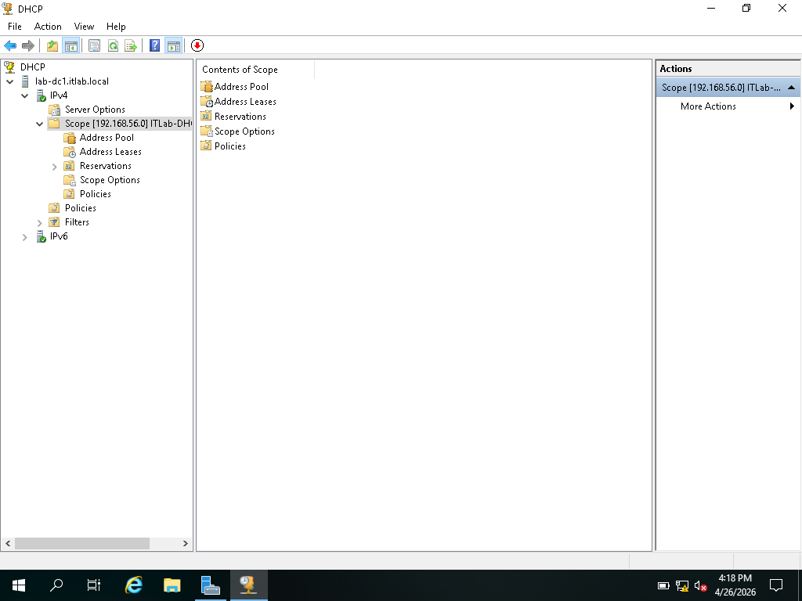

> Installed and configured DHCP Server role with scope
> ITLab-DHCP-Scope assigning IPs from 192.168.56.100
> to 192.168.56.200 automatically to domain clients

---

*🔟 Organizational Units Structure*

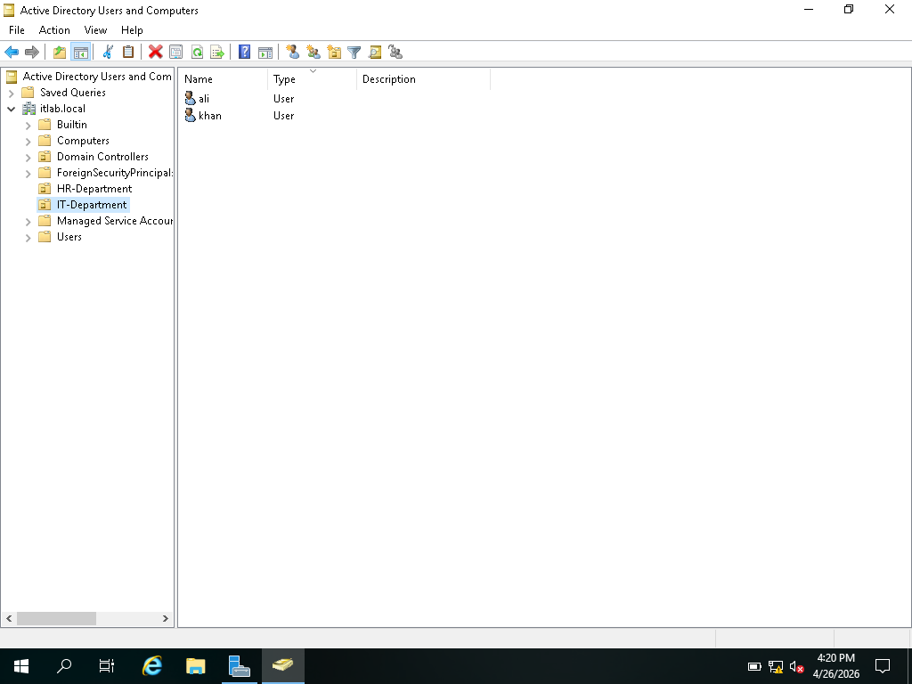

> Created Organizational Units IT-Department and
> HR-Department to organize domain users professionally
> ali and Khan moved to IT-Department

---

*1️⃣1️⃣ HR-Department OU*

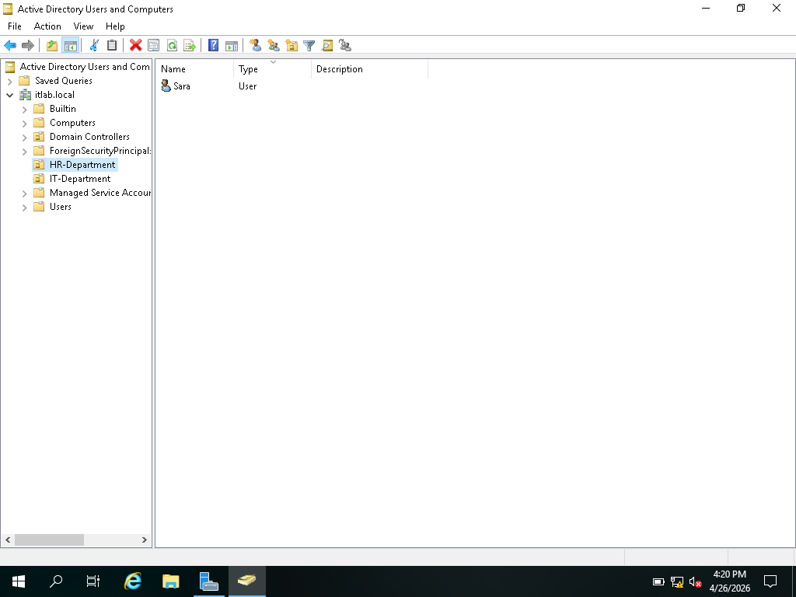

> Created HR-Department OU and added user Sara
> demonstrating multi-department AD structure

---

*1️⃣2️⃣ IT-Department Group Policy*

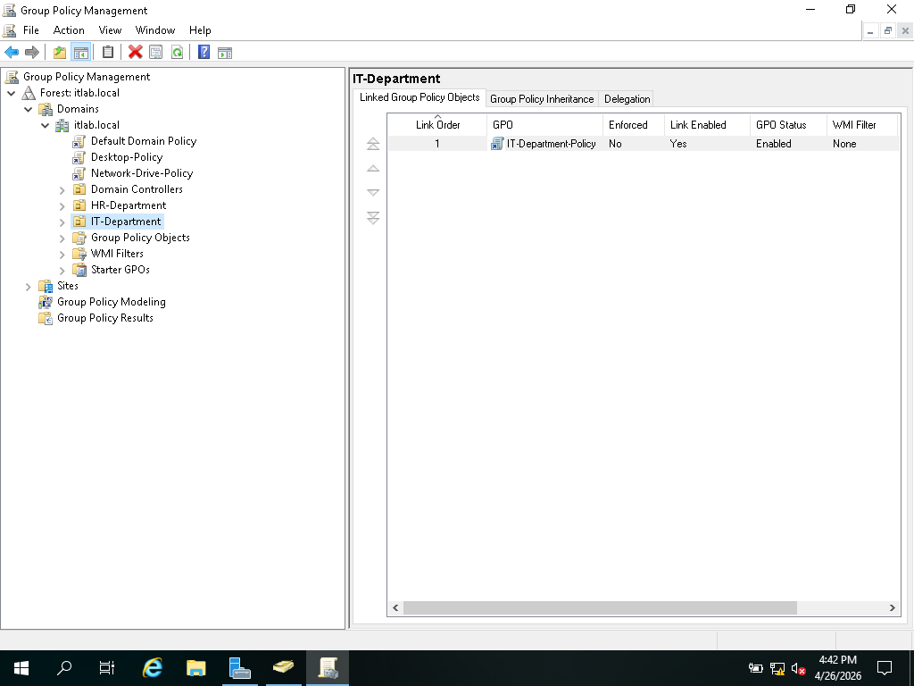

> Created IT-Department-Policy GPO linked specifically
> to IT-Department OU for department-level policy control

---

*1️⃣3️⃣ Password Policy Settings*

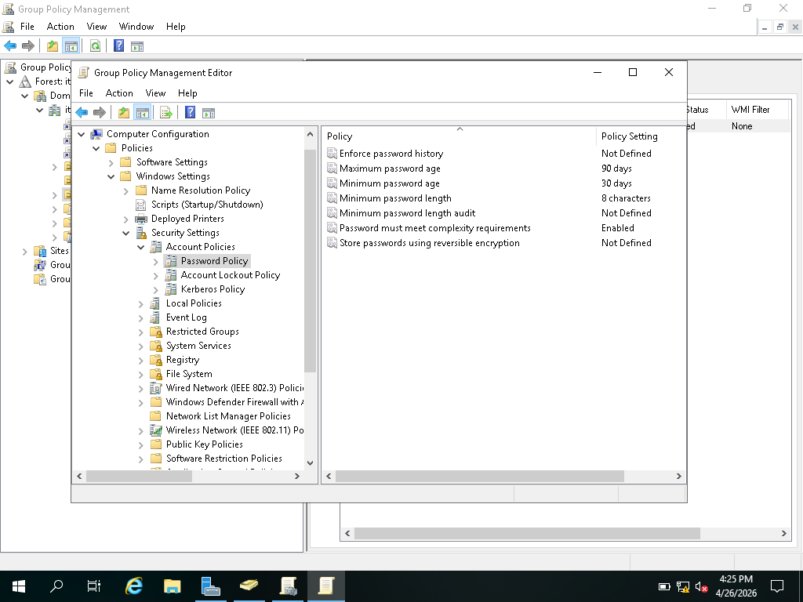

> Configured password policy for IT-Department:
> minimum 8 characters, complexity required,
> maximum password age 90 days

---

*1️⃣4️⃣ DHCP Client IP Received*

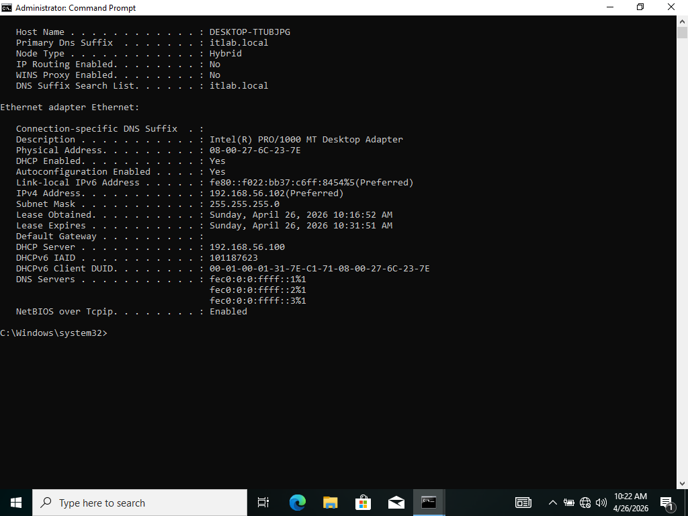

> Windows 10 client automatically received IP 192.168.56.102
> from DHCP server proving automatic IP assignment working

---

*1️⃣5️⃣ Remote Desktop Connection*

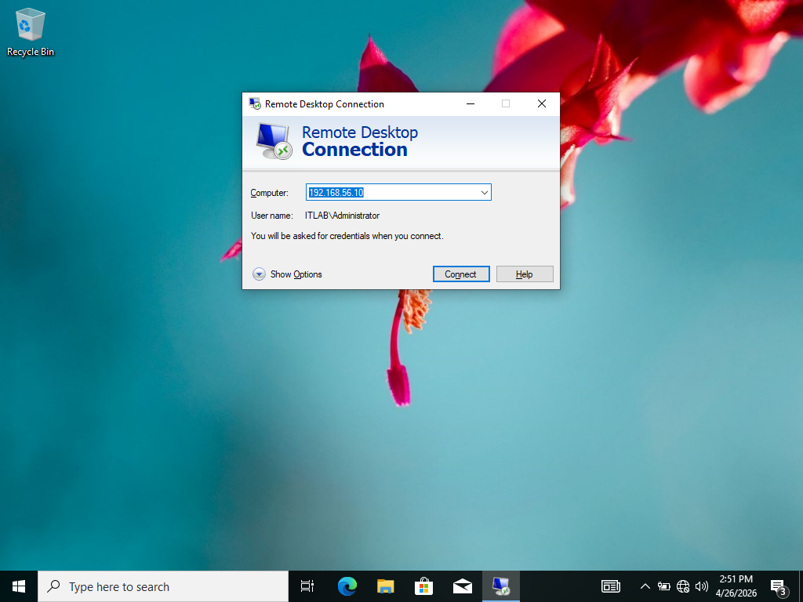

> Connected to Windows Server 2019 remotely from
> Windows 10 using Remote Desktop Protocol (RDP)

---

*1️⃣6️⃣ Server Desktop via RDP*

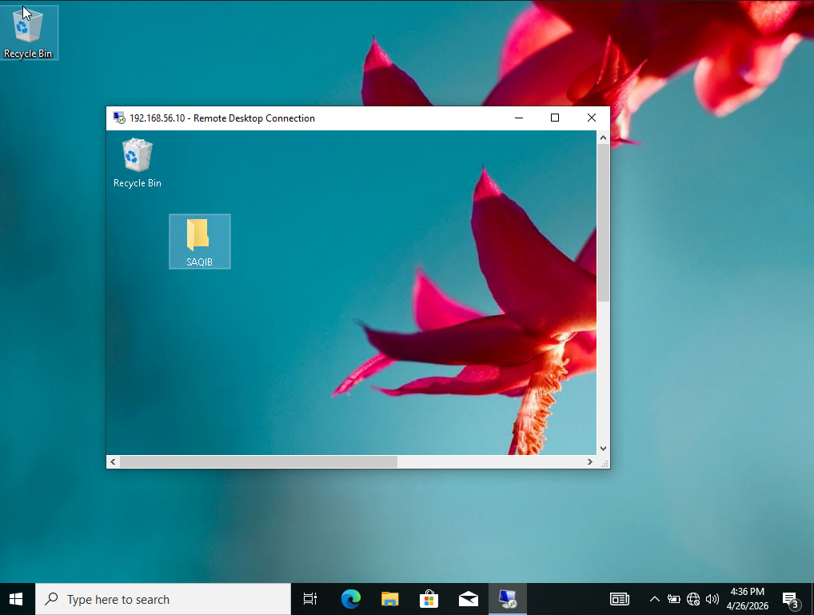

> Windows Server 2019 desktop accessed and controlled
> remotely from Windows 10 client via RDP connection

---

*1️⃣7️⃣ Event Viewer Security Log*

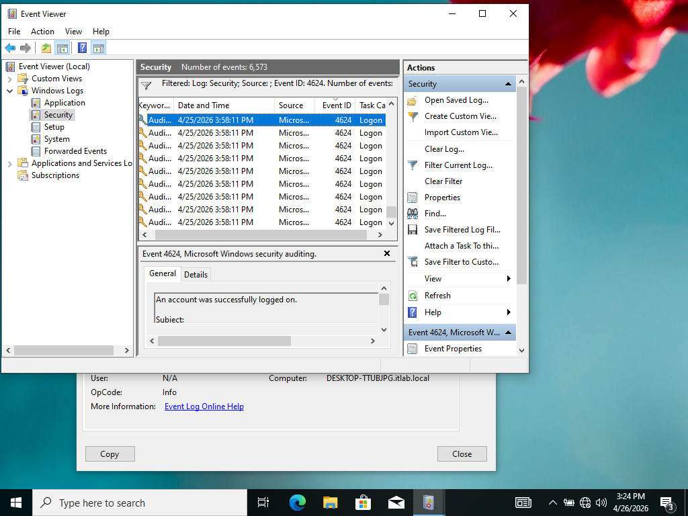

> Monitored security events in Event Viewer showing
> all login attempts with Event ID 4624 filtered

---

*1️⃣8️⃣ Event Details — Login Audit*

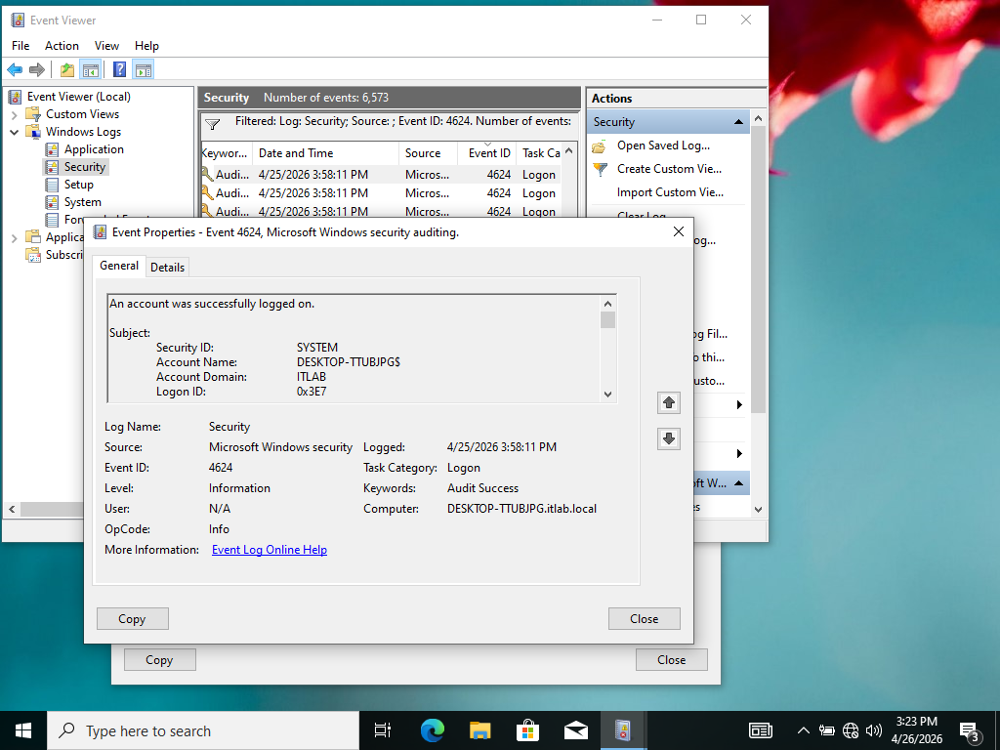

> Security event details showing Account Name, Domain,
> Logon ID and timestamp — used for security auditing

---

## 🎯 Skills Demonstrated
- Active Directory Administration
- DNS Configuration & Troubleshooting
- Group Policy Object (GPO) Management
- DHCP Server Installation & Configuration
- Organizational Units (OUs) Management
- Remote Desktop Services (RDP)
- Event Viewer & Security Log Monitoring
- Network File Sharing & NTFS Permissions
- VirtualBox Network Configuration
- Windows Server 2019 Administration
- Domain User & Group Management
- Password Policy Configuration
